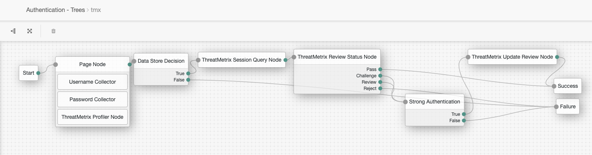

<!--
 * The contents of this file are subject to the terms of the Common Development and
 * Distribution License (the License). You may not use this file except in compliance with the
 * License.
 *
 * You can obtain a copy of the License at legal/CDDLv1.0.txt. See the License for the
 * specific language governing permission and limitations under the License.
 *
 * When distributing Covered Software, include this CDDL Header Notice in each file and include
 * the License file at legal/CDDLv1.0.txt. If applicable, add the following below the CDDL
 * Header, with the fields enclosed by brackets [] replaced by your own identifying
 * information: "Portions copyright [year] [name of copyright owner]".
 *
 * Copyright 2019 ForgeRock AS.
-->
# ThreatMetrix Authentication Nodes

The ThreatMetrix authentication nodes lets administrators integrate ThreatMetrix decision tools into an AM
 authentication trees.

## Usage

To deploy these nodes, download the jar from the releases tab on github 
[here](https://github.com/ForgeRock/ThreatMetrix-Auth-Tree-Nodes/releases/latest). Next, copy the jar into the 
../web-container/webapps/openam/WEB-INF/lib directory where AM is deployed. Restart the web container to pick up the 
new nodes. The nodes will then appear in the authentication trees components palette.

### ThreatMetrix Profiler Node
This node tags the AM login page with the ThreatMetrix JS to collect information about the event.

#### ThreatMetrix Profiler Node Configuration
* **Org ID** - Org ID is the unique id associated with ThreatMetrix generated for your organization.
* **Page ID** - The Page ID is an identifier to be used if you place the ThreatMetrix tag on multiple pages.
* **Profiler URI** - ThreatMetrix Profiler URI.
* **Use Client Generated Session IDs** - If the ThreatMetrix Javascript is separately integrated into the application
 from the ForgeRock XUI, then enable this property to be able to pass the ThreatMetrix Session ID from the client
  side via the <code>HiddenValueCallback</code>.
  
### ThreatMetrix Session Query Node
This node makes a request the ThreatMetrix Session Query API to retrieve a policy decision about the previously
 generated user session.
 
#### ThreatMetrix Session Query Node Configuration

 * **API Key** - This is a unique key allocated by ThreatMetrix and associated with an Org Id.
 * **Service Type** - Restricts which output fields are returned based on the level of access that a customer has
. The service type is linked to an API Key and verified during a call. Generally, the most common service type is 
 session-policy.
 * **Event Type** - Specifies the type of transaction or event.
 * **Policy** - The policy to be used for the query.
 * **Session Query URI** - ThreatMetrix Session Query URI.
 * **Add Shared State Variables To Request** - If you'd like to add additional parameters to the Threat Metrix
 Session Query request, enable this option to iterate over the map of user attributes at key
 tmx_session_query_parameters. Note: A custom scripted or native authentication node must be written to set these
 attributes in shared state.
 
 ### ThreatMetrix Review Status Node
 This node analyzes the response from the ThreatMetrix Session Query Node and routes to the <code>Pass</code>, 
 <code>Challenge</code>, <code>Review</code> or <code>Reject</code> node outcomes.
 
 ### ThreatMetrix Policy Score Node
 This node analyzes the response from the ThreatMetrix Session Query Node and checks to see if the risk score is
 above the configured value.
  
 #### ThreatMetrix Policy Score Node Configuration
 
  * **Policy Score Threshold** - The policy score threshold of the policy which is calculated based on the sum of the
 risk weights for each of the rules configured within it.
 
 ### ThreatMetrix Reason Code Node
 This node analyzes the response from the ThreatMetrix Session Query Node and checks to see if an individual reason
  code has been returned. These reason codes correspond to ThreatMetrix Rule Names within a ThreatMetrix Policy.
 
 #### ThreatMetrix Reason Code Node Configuration
 * **Reason Code Outcomes** - A list of Reason Codes that you would like to check for from a ThreatMetrix policy
  evaluation. When a Reason Code is added to this list, a new outcome will presented on the node. The node will
   iterate through the configured Reason Code until a Reason code is found and will return that outcome. Otherwise
    the <code>None Triggered</code> outcome will be returned.
 
  ### ThreatMetrix Update Review Node
  This node calls the ThreatMetrix Update API to update the session with the Final Review Status for the users session.
   
  #### ThreatMetrix Update Review Node Configuration
  
   * **API Key** - This is a unique key allocated by ThreatMetrix and associated with an Org Id.
   * **Final Review Status** - Indicates the value of the new status that the transaction should be updated to.
   * **Notes** - An optional notes parameter that allows you to append any notes such as why the review status is
   being updated.
   * **Trust Tag Name** - The Trust Tag Name from one of ThreatMetrix's predefined set of Global Trust Tags.
   * **Trust Tag Context** - The Trust Tag Context from one of ThreatMetrix's Predefined set of Contexts. This is 
    mandatory if the tag name is passed.
   * **Line of Business** - The Line of Business as specified by the customer.
   * **Update URI** - ThreatMetrix Update URI.
 
 ### Example Flow
 
 
 